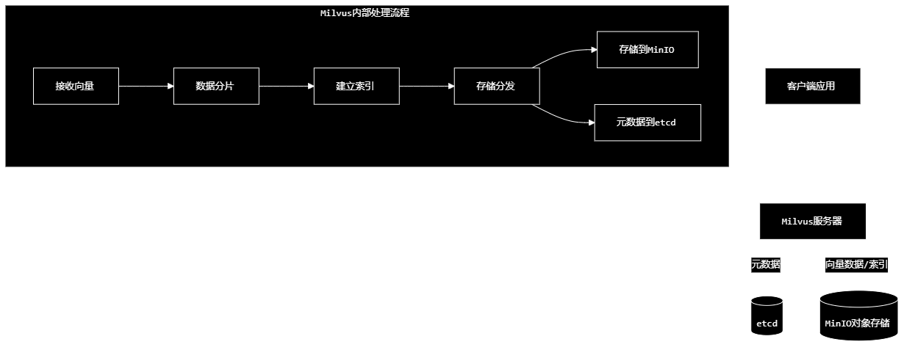

📊 服务选择建议
向量数据库	适用场景	优势	连接方式
Redis	小到中等规模数据集	简单快速，可复用现有Redis	192.168.80.131:6379
Qdrant	中等规模数据集，需要高级搜索功能	专业向量数据库，支持过滤	192.168.80.131:6333
Milvus	大规模数据集，企业级应用	分布式，支持海量数据	192.168.80.131:19530
这样配置后，您可以在192.168.80.131 VM上同时运行三种向量数据库，根据应用需求选择最适合的存储

1. Redis Vector Store
   特点：

基于Redis的向量搜索功能
内存存储，性能极高
适合小到中等规模数据
可以复用现有Redis基础设
2. Qdrant
   特点：

专业向量数据库
支持高精度向量搜索
内存+存储混合架构
支持过滤、聚类等高级功能
适用场景：

3. Milvus
   特点：

企业级向量数据库
支持海量数据（十亿级向量）
分布式架构
云原生设计
场景	推荐选择	原因
小型项目(<10万向量)	Redis	简单快速，无需额外部署
中型项目(10万-1000万)	Qdrant	专业向量数据库，功能完善
大型项目(>1000万向量)	Milvus	分布式，支持海量数据
🔧 在您的项目中使用
根据您的配置，建议：

生产环境：选择Qdrant（功能完善，性能好）
开发测试：使用Redis（简单，无需额外服务）
企业级应用：考虑Milvus（可扩展性强）

MinIO在Milvus中的作用
1. 向量数据持久化存储
   Milvus将向量数据分为两部分：

元数据：存储在etcd中（向量ID、标签等）
实际向量数据：存储在MinIO中（高维向量数组、索引文件）
用户上传向量 → Milvus处理 →
├─ 元数据 → etcd
└─ 向量数据 → MinIO (对象存储)

2. 索引文件管理
   Milvus支持多种向量索引（HNSW、IVF_FLAT等），这些索引文件较大，需要高效存储：

Milvus索引结构：
├─ 向量原始数据 (Large files)
├─ 索引文件 (Large files)
└─ 元数据 (Small data)
3. 分布式架构支持
   在集群模式下，多个Milvus节点需要共享访问：

MinIO提供统一的对象存储访问点
所有节点都能访问相同的向量数据
支持水平扩展

🏗️ Milvus架构图解

存储类型	适合场景	Milvus中的用途
MinIO	大文件、非结构化数据	向量数据、索引文件
etcd	小量键值数据、元数据	配置、元数据
传统数据库	结构化数据查询	不适合海量向量

什么是etcd？
etcd是一个分布式键值存储系统，专为云原生环境设计，在Milvus架构中扮演元数据存储的关键角色。

📋 etcd基础介绍
定义
etcd = etc + d (distributed)
etc: Unix/Linux系统中的配置目录(/etc)
d: 分布式(distributed)
含义: 分布式系统的配置存储中心
核心特性
强一致性：所有节点看到相同数据
高可用：集群容错，单点故障不影响服务
Watch机制：实时监控数据变化
分布式锁：支持并发控制
TTL支持：键值自动过期
🏗️ 在Milvus中的角色
1. 元数据管理中心
2. 
   存储的具体内容
   数据类型	例子	用途
   Collection元数据	{name: "docs", dimension: 1536}	定义向量集合结构
   Partition信息	partition_1, partition_2	数据分片管理
   向量ID映射	id_123 -> file_abc	向量与原始数据关联
   索引配置	{type: "HNSW", M: 16}	搜索索引参数
   节点状态	node_1: active, node_2: active	集群健康监控

3.
etcd vs 其他存储系统
存储系统	一致性模型	适用场景	Milvus中的用途
etcd	强一致性	元数据、配置	✅ 集群元数据管理
Redis	最终一致性	缓存、临时数据	❌ 不适合持久化元数据
ZooKeeper	强一致性	分布式协调	✅ 可替代etcd
MinIO	最终一致性	对象存储	❌ 不适合元数据